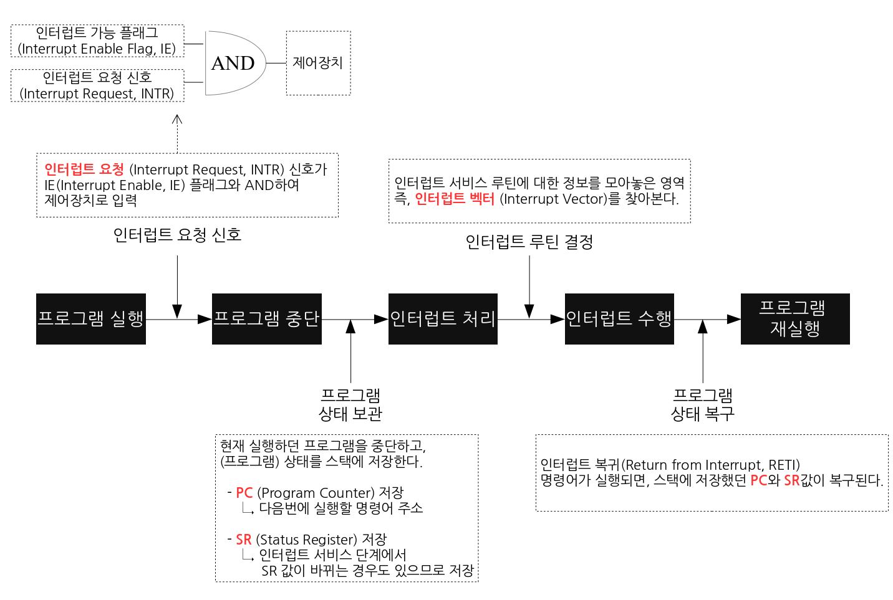
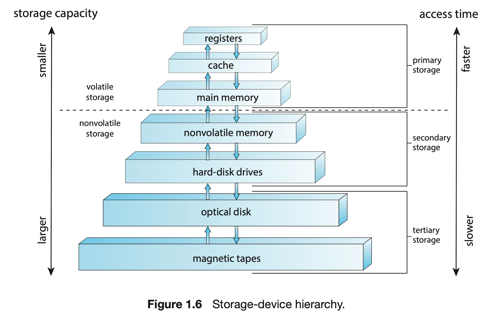

# Chapter 01 Introduction

## OS
컴퓨터 하드웨어를 관리하는 소프트웨어

## 1.1 운영체제가 할 일

컴퓨터 시스템 : 하드웨어, 운영체제, 응용 프로그램, 사용자

### User View

사용자의 편의성을 위해 설계한다.

### System View

OS는 하드웨어와 가장 밀접하게 연관된 프로그램으로, 자원 할당자(resource allocator)라고 할 수 있다.

여러 입출력 장치와 프로그램을 제어해야하므로 제어 프로그램(controll program)이라고도 할 수 있다.

### 정의

보편적인 정의는 없지만 일반적으로 컴퓨터에서 항상 실행되는 프로그램 (커널) 이라 할 수 있다.

## 1.2 컴퓨터 시스템의 구성

하나이상의 CPU, 장치 컨트롤러(공통 버스로 구성요소와 메모리 사이 엑세스)

장치 컨트롤러에는 각각 장치 드라이버 존재.

CPU와 장치 컨트롤러는 메모리 사이클을 놓고 경쟁

### Interrupts

인터럽트를 이해하기에 좋은 사진이 있어서 가져왔다.

OS에서는 아래와 같은 더 정교한 인터럽트 처리기능이 필요하다. 이는 CPU와 인터럽트 컨트롤러 하드웨어에서 처리한다. 

1. 더 중요한 작업중엔 인터럽트 처리 연기
2. 적절한 인터럽트 핸들러로 효율적으로 디스패치 할 방법 필요
3. 우선순위에 따라 인터럽트 관리 및 그에 따른 적절한 대응

### Storage Structure

CPU는 메모리에서만 명령을 적제할 수 있으므로 프로그램을 먼저 메모리에 적재해야하고, 대부분 메인 메모리(Random-Access-Memory)에서 가져온다.

RAM은 휘발성 이기에 EEPROM등의 비휘발성 메모리도 사용한다.

이상적으로 메인 메모리에 프로그램과 데이터등을 전부 올려두면 좋다. 하지만 메인 메모리는 작고, 휘발성이기에 불가능하다. 메인 메모리를 확장하기위해 보조저장장치를 제공한다. 이는 HDD 와 NVM이 있다.

레지스터, 메인 메모리, 보조저장장치 말고도 다른 구성요소도 있다. 캐시 메모리, CD, Blu-ray, 자기 테이프 등이 있다.

아래 그림은 용량, 속도 등을 기준으로 만든 저장장치 계층구조이다. 

### I/O structure

적은 양의 데이터 I/O는 인터럽트 I/O형태로 해도 좋지만, 저장장치에서 데이터를 읽는 등의 대용량 I/O는 오버헤드가 크다. 따라서 이를 해결하기 위해 직접 메모리 액세스(DMA)가 사용된다.

CPU개입없이 작업되며, 데이터 블록이 전송 완료 될 때마다 인터럽트가 발생한다. 전송 작업동안 CPU는 다른 작업을 할 수 있어서 효율적이다. 

## 1.3 Computer System Architecture

### Single Processor Systems

단일 처리 코어인 하나의 CPU로 단일 프로세서 사용

코어는 명령을 실행하고 데이터 저장을 위한 레지스터를 가지는 구성요소이다. 

### Multiprocessor Systems

대부분의 컴퓨터가 Multiprocessor System이다. 단일코어 CPU가 있는 n개의 프로세서를 가진다. 프로세서는 버스, 클록, 메모리, 장치를 공유한다.

멀티 프로세서는 처리량을 증가시켜준다는 장점이 있다. 하지만 이는 n개의 프로세서가 n배의 작업량을 보장한다는것은 아니다. 여러 프로세서가 같이 작업할때 이를 올바르게 유지하는데에 오버헤드가 발생하기 때문이다. 

일부 프로세서는 작업이 많아 과부하되고, 일부 프로세서는 작업이 적어 놀고있으면 비효율적이므로 잘 처리해야한다. (5장, 6장에서 다룬다고함.)

이후 발전을 거쳐 한 프로세서내에 여러개의 코어가 있는 다중 코어 시스템이 나오게된다. 이는 프로세서내의 소통이 다른 프로세서간의 소통보다 빠르기에 더 효율적일 수 있다. 또한 전력 소모량에서도 강점을 보인다. 

한 프로세서 내의 각 코어는 각자의 캐시를 가지고, 공통 캐시를 공유한다. 이렇게 처리하여 N개의 코어를 가진 프로세서는 N개의 CPU처럼 작동할 수 있다. (이를 효율적으로 처리하는 방법은 4장에서 배운다.)

위처럼 CPU를 추가하게 되면 성능이 향상되지만 확정성이 좋은것은 아니다. 이를 해결하기 위해 각 CPU에 빠르게 액세스 할 수 있는 로컬 메모리를 두고, 모든 CPU가 서로 interconnect 되어 하나의 물리 주소 공간을 공유한다. 이를 NUMA (non-uniform memory access)라고 한다. (이 방법 또한 한 CPU가 다른 CPU의 저장공간에 액세스할때는 느려서 성능 저하가 발생하는데, 5장 10장에서 알려준다고 한다.)

### Clustered Systems

클러스터 시스템은 n개의 독자적인 시스템 또는 노드들을 연결하여 구성하는 것이다. 

클러스터링은 availability를 제공하기 위해 사용된다. 일부의 시스템이 고장나더라도 고장나지 않은 나머지가 서비스를 계속 제공할 수 있다. 

## 1.4 Operating-System Operations

부트스트랩 프로그램은 CPU레지스터, 장치 컨트롤러, 메모리등의 시스템의 모든 측면을 초기화한다.
그리고 운영체제 커널을 찾아 메모리에 적재해야 한다. 

### multiprogramming and multitasking

OS는 여러 프로세스를 동시에 메모리에 유지한다.(9장 10장에서 메모리 관리 방식을 배운다.) 그리고 그중 하나를 선택하여 실행한다. 프로세스가 하나라도 실행되고 있으면 CPU는 유휴상태가 될 수 없다. 

멀티 테스킹은 여러 프로세스를 빠르게 전환하여 사용자에게 빠른 응답시간을 제공하는 것이다. (어떤 프로세스를 실행할지 선택하는 CPU 스케줄링은 5장에서 배운다.)

멀티 테스킹에서 적절한 응답 시간을 보장하기 위해 사용하는 일반적인 방법은 가상 메모리를 사용하는 것이다. 이는 메모리에 일부만 적재된 프로세스의 실행을 허용하는 것으로, 프로그램이 물리 메모리보다 더 커도 실행할 수 있다는 장점이 있다. 이는 메인 메모리를 균등한 저장장치의 배열로 추상화 하여 논리 메모리를 물리 메모리로부터 분리시킨다(10장에서 좀더 자세히 설명할 듯 하다. 뿐만 아니라 책 전반에서 이로 인해 생길 수 있는 문제들에 대한 설명이 나오는듯 하다.)

### Dual-Mode and Multimode Operation (왜 하나는 -Mode이고 하나는 mode인지 모르겠다. 번역이 그지같은건가...)

OS는 잘못된 프로그램으로 부터 안전해야 한다. 이를 위해 적어도 두개의 독립된 연산모드가 필요하다. 이는 사용자 모드와 커널모드이다. 

모드 비트에 따라 0이면 커널모드, 1이면 사용자 모드이다. 시스템이 처음 부트될때 커널 모드에서 실행되고, 운영체제 적재 이후 사용자 모드에서 프로세스가 시작된다. 사용자 모드에서 트랩이나 인터럽트가 발생하면 모드 비트를 0으로 전환하여 커널모드로 전환하게 된다. 즉 운영체제가 컴퓨터의 제어를 얻을때마다 커널모드가 된다. 그리고 시스템이 사용자 프로그램으로 제어를 넘길때 사용자 모드로 전환한다.

이중모드는 운영체제에 악영향을 끼칠 수 있는 명령들을 privileged instruction으로 지정하여 보호하는데, 이들은 커널모드에서만 실행할 수 있다. 만약 사용자 모드에서 시도될 경우 하드웨어는 트랩을 걸어서 막는다. 

priviledged instruction(이후 특권 명령으로 쓰겠다)은 커널모드로의 전환, I/O제어, 타이머 관리, 인터럽트 관리 등이 있다. (책 전반에서 여러 특권명령에 대해 다룰 예정)

시스템 콜은 지정되어 있는 작업을 프로그램을 대신하여 운영체제가 수행하도록 하는 것이다. 일반적으로 인터럽트 벡터의 특정 위치로 트랩을 거는 형태를 취한다. (2.3절에서 시스템 콜에 대해 다룰 예정)

### Timer

시스템이 무한루프에 빠지거나, 서비스 호출에 실패하여 제어가 복귀하지 않는 경우가 생기지 않도록 해야한다. 이를 위해 타이머를 사용한다.

일정 시간이 지나면 타이머는 인터럽트를 발생시켜서 제어가 운영체제로 넘어가며, 운영체제는 이를 에러로 취급하거나, 특권명령을 통해 프로그램에 더 많은 시간을 부여할 수 있다. 

## 1.5 Resource Management

### 프로세스 관리

프로그램 자체는 프로세스가 아니다. 프로그램은 수동적인 개체지만, 프로세스는 프로그램 카운터를 가진 능동적인 개체이다. 

프로세스는 한 시스템 내의 작업의 단위이다. 시스템은 프로세스의 집합으로 구성되는데, 프로세스 중 일부는 운영체제 프로세스이며, 나머지는 사용자 프로세스이다. 

OS는 프로세스 관리에 대해 아래의 5가지를 보장해야 한다.

- 사용자 프로세스와 시스템 프로세스 생성 및 제거
- CPU에 프로세스, 스레드 스케줄
- 프로세스의 일시 중지와 재수행
- 프로세스 동기화를 위한 기법 제공
- 프로세스 통신을 위한 기법 제공

이것들을 3장부터 7장까지 다룰 것이다.

### 메모리 관리

## 느낀점

OS에 관련해서 내가 너무 모르고 있다는게 서론만 읽어도 알 수 있었다. 딱 제목만 알고 내용은 하나도 모르는 상태이다. 열심히 책 읽어서 os에 대해 잘 알게 되어야 겠다.
보면 볼수록 1단원은 답이 없어서 걍 2단원부터 봐야겠다...

### 참고자료

- https://whatisthenext.tistory.com/147
- 