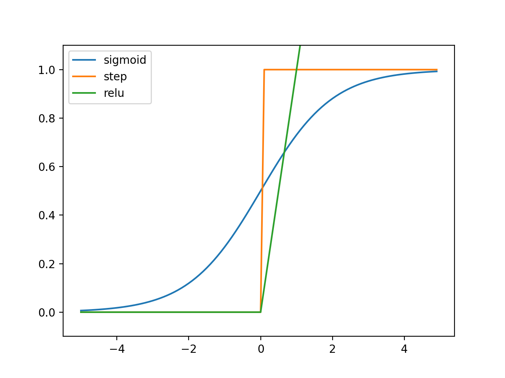

# 신경망 

3챕터에선 신경망의 개요를 배우고, 신경망이 입력 데이터를 식별하는 처리 과정을 알아본다.

## 신경망

입력층, 은닉층, 출력층으로 이루어져 있다. <br>
0층이 입력층, n-1층이 출력층, 나머지가 은닉층이다. 

## 활성화 함수

- 입력신호의 총합을 출력신호로 변환하는 함수

- 활성화 함수는 비선형 함수를 사용해야 한다.
    - 선형함수를 사용할 경우 여러 층으로 구성하더라도 은닉층이 없는 네트워크와 같아지기 때문
    
### 시그모이드 함수
- S자 모양이라는 뜻으로 S모양의 그래프를 가지는 함수이다. 

- 수식은 아래와 같다.
$$
h(x) = \frac{1}{1+\exp(-x)}
$$

- 코드
``` python
import numpy as np
import matplotlib.pylab as plt

def sigmoid(x):
    return 1/(1+np.exp(-x))

# display sigmoid with graph

x = np.arange(-5.0, 5.0, 0.1)
y = sigmoid(x)
plt.plot(x,y)
plt.ylim(-0.1, 1.1)
plt.show()
```

### 계단함수
- 임계값을 경계로 출력이 바뀌는 함수
- 코드
``` python
import numpy as np
import matplotlib.pylab as plt

def step_function(x) :
    return np.array(x>0, dtype = np.int)

# display step_function with graph

x = np.arange(-5.0, 5.0, 0.1)
y = step_function(x)
plt.plot(x,y)
plt.ylim(-0.1,1.1)
plt.show()
```

### ReLU 함수 (Rectified Liner Unit)
- 입력값이 0을 넘으면 출력, 이하이면 0을 출력
- 수식
$$
h(x) =
  \begin{cases}
    x   & \quad x \geq 0\\
    0   & \quad x < 0
  \end{cases}
$$
- 코드
``` python
import numpy as np
import matplotlib.pylab as plt

def relu(x):
    return np.maximum(0,x)

# display ReLU with graph

x = np.arange(-5.0, 5.0, 0.1)
relu = relu(x)
plt.plot(x,relu, label = "relu")
plt.ylim(-0.1,1.1)
plt.legend()
plt.show()
```

## 그래프 


## 다차원 배열의 계산

### 행렬의 곱
``` python
np.dot(A,B)
```
### 신경망에서의 행렬 곱

- 표기법
    - 다음층의 a번째 뉴런, 앞층의 b번째 뉴런, c층의 가중치를 아래와 같이 표현한다.

$$ w_{a b}^{(c)} $$

- 입력층의 입력값을 X, 1층의 값을 $A^{(1)}$, 1층의 가중치를 $W^{(1)}$, 1층의 편향을 $B^{(1)}$라 하면 다음과 같은 식으로 표현할 수 있다.

$$ A^{(1)} = X\times W^{(1)} + B^{(1)}$$


## 출력층 설계

신경망은 분류와 회귀에 사용할 수 있는데, 어떤 문제이냐에 따라 출력층의 활성화 함수가 달라진다.

### 항등함수

일반적으로 회귀문제일때 출력층의 활성화 함수에 항등함수를 사용한다.

### 소프트맥스 함수

일반적으로 분류문제일때 출력층의 활성화 함수에 소프트맥스 함수를 사용한다.

- 수식은 다음과 같다
$$
y_{k}=\frac{\exp(a_{k})}{\displaystyle\sum_{i=1}^n{\exp(a_i)}}
$$

- 위의 수식은 a값이 커질때 지수함수로 커지기에 문제가 생길 수 있다. 따라서 아래와 같은 방법으로 해결한다.
$$
y_{k}
= \frac{\exp(a_{k})}{\displaystyle\sum_{i=1}^n{\exp(a_i)}}
= \frac{C\exp(a_{k})}{C\displaystyle\sum_{i=1}^n{\exp(a_i)}}
= \frac{\exp(a_{k}+\log C)}{\displaystyle\sum_{i=1}^n{\exp(a_i+\log C)}}
= \frac{\exp(a_{k}+ C^\prime)}{\displaystyle\sum_{i=1}^n{\exp(a_i + C^\prime)}}
$$

- $C^\prime$ 값을 이용하여 입력값의 최댓값을 빼주는것으로 오버플로우를 막는다.

- 코드
``` python
def softmax(a):
    c = np.max(a)
    exp_a = np.exp(a-c)
    sum_exp_a = np.sum(exp_a)
    y = exp_a / sum_exp_a

    return y
``` 

- 소프트맥스 함수의 출력값은 0에서 1사이의 값이고, 합이 언제나 1이기에 확률로 해석할 수 있다. 
- $ y = \exp(x)$ 는 단조 증가하는 함수이기에 소프트맥스 함수를 사용하더라도 대소관계가 변하지 않는다.

### 위의 내용을 반영한 3층 신경망 코드

``` python
import numpy as np

def init():
    network = {}
    network['W1'] = np.array([[0.1,0.3,0.5], [0.2,0.4,0.6]])
    network['W2'] = np.array([[0.1,0.4],[0.2,0.5],[0.3,0.6]])
    network['W3'] = np.array([[0.1,0.3], [0.2,0.4]])
    network['b1'] = np.array([[0.1,0.2,0.3]])
    network['b2'] = np.array([[0.1,0.2]])
    network['b3'] = np.array([[0.1,0.2]])

    return network

def sigmoid(x):
    return 1/(1+np.exp(-x))

def softmax(a):
    c = np.max(a)
    exp_a = np.exp(a-c)
    sum_exp_a = np.sum(exp_a)
    y = exp_a / sum_exp_a

    return y

def identity_function(x):
    return x

def forward(network,x,problem):
    W1, W2, W3 = network['W1'],network['W2'],network['W3']
    b1, b2, b3 = network['b1'],network['b2'],network['b3']

    a1 = np.dot(x,W1) + b1
    z1 = sigmoid(a1)
    a2 = np.dot(z1,W2) + b2
    z2 = sigmoid(a2)
    a3 = np.dot(z2,W3) + b3
    if(problem == 'classification'):
        y = softmax(a3)
    else:
        y = identity_function(a3)
    return y

network = init()
x = np.array([1.0,0.5])
# if problem is classification
y1 = forward(network,x,'classification')
print(y1)
# if problem is regression
y2 = forward(network,x,'regression')
print(y2)
```

## 손글씨 숫자 인식

위의 3층 신경망 코드에 직접 mnist 손글씨 데이터를 넣는다.

[코드 깃 링크](https://github.com/WegraLee/deep-learning-from-scratch/blob/master/ch03/neuralnet_mnist_batch.py)

### 배치 처리
1개의 데이터를 입력하는거보다 여러 데이터를 한번에 묶음으로 입력하는것이 더 빠르기에 위의 링크에선 배치의 사이즈를 100으로 하여 입력하였다.

> 수치 계산 라이브러리들이 입력값이 큰것에 대해 최적화가 잘 되어있고, I/O횟수가 줄어서 더 빨라진다.