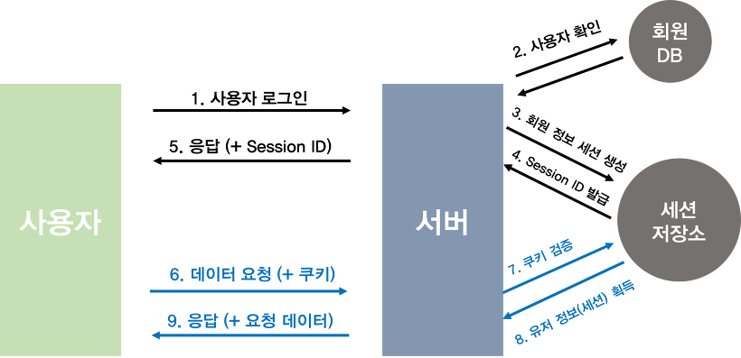
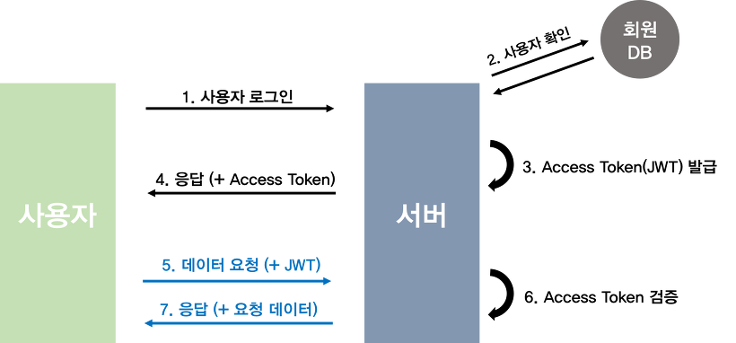

# authorization

Node 공부를 하면서 제일 먼저 하게 된게 유저 인증이다. 매번 요청을 보낼때마다 로그인 과정을 거칠 수는 없기에 인증 할 방법이 필요하다.

## 인증 방법

## 1. 세션/쿠키 방식

세션은 두 매체의 통신 연결 상태를 의미한다. 

세션/ 쿠키 방식은 서버가 가지고 있는 세션 정보와 사용자가 보내준 쿠키를 검증하는 방식이다.

로그인이 성공하면 서버는 유저정보로 세션을 만든뒤 세션 id를 resposne에 담아서 보내준다. 

유저는 받은 세션 id를 쿠키에 저장해둔뒤 그 이후의 request에 쿠키를 담아서 보낸다. 

서버는 쿠키에 있는 세션 id와 user정보를 매칭하여 그에 따른 응답을 유저에게 해준다.

### 단점

서버에 유저마다 세션을 저장해둬야 하기 때문에 서버 부하가 더 높아진다.

## 2. 토큰 방식 (JWT)

JWT는 Json Web Token의 약자이다. 토큰 방식의 인증방법을 사용할때 헤더에 토큰을 실어서 보낸다.

토큰은 Header, Payload, Verify Signature로 이뤄지고 "."으로 구분한다. 

Header, Payload는 단순히 16진수로 인코딩 하고 Verify Signature는 Header, Payload에 Secret Key를 더해서 암호화 한다. 

로그인에 성공하면 서버는 유저 id를 포함한 정보를 담은 Payload를 만든다.(payload는 누구나 디코딩 할 수 있기때문에 중요 정보를 넣지 않는다.)

Secret Key를 이용해 토큰을 발급하고 response에 담아 보낸다.

유저는 토큰을 요청마다 헤더에 토큰을 실어 보낸다.

요청이 왔을때 Secret Key로 토큰을 검증 한후 payload안의 유저 id로 유저를 식별한다. 

### 장점

세션과 달리 서버에 저장해둬야할 정보가 없다.

### 단점

털리면 유효기간 내에선 계속 털려야 한다. (Refresh Token 으로 해결)

세션에 비해 토큰의 길이가 길어서 요청이 많아지면 자원낭비

## Refresh Token

Refresh Token 과 Access Token의 두 Token을 이용하여 Access Token만 사용하는 방식의 단점을 보완한다.

짧은 유효기간을 가진 Access Token과 상대적으로 긴 유효기간을 가진 Refresh Token을 이용하여 Access Token을 같은 방법으로 운용하다가 유효기간이 끝나면 다시 로그인 하지 않고 Refresh Token 인증을 통해서 Access Token을 다시 발급 받는 형식이다. 

로그인시 Refresh Token 과 Access Token을 발급 받는다.

유저는 요청시 Access Token을 이용하여 요청을 보낸다. 

Access Token이 만료되었을 경우 서버는 만료되었음을 유저에게 알리고 유저는 Refresh Token을 보낸다.

Refresh Token이 유효하면 다시 Access Token을 발급하고 만료 되었으면 다시 로그인 하여 두 Token을 다시 발급 받는다.

> 토큰의 만료 사실은 payload에서 알 수 있기 때문에 서버에 보내지 않고 클라단에서 재발급 요청을 보내도 된다. 