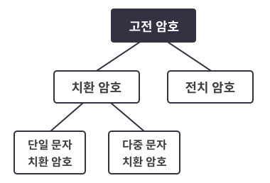

# Stage2 고전암호와 현대 암호

# 고전암호
고전 암호들은 컴퓨터를 사용하면 바로 복호화 가능하기에 이젠 사용하지 않는다. 
<br>



- 치환 암호 : 문자를 다른 문자로 바꾸는것
- 전치 암호 : 문자들의 위치를 바꾸는것

## 단일 문자 치환 암호
각 문자를 약속된 문자로 바꾸는것<br>
- ex) 카이사르 암호
    - 일정 위치만큼 알파벳을 밀어내는것
    - 26가지 케이스가 있을 수 있다. (근데 키가 0이면 그게 암호인가 싶긴 함ㅋㅋ)
- ex) 춤추는 인형암호
    - 셜록 홈즈에 나온다고 함.
    - 각 인형 그림 하나가 하나의 알파벳에 대응됨
    - 키공간이 26!이라 컴퓨터도 다 계산하긴 힘듦. 하지만 언어적 특성이 사라지는것은 아니기에 이것 또한 복호화가 쉽다.
    - 
- ex) 난수표, 코드북 이용
    - 이건 복호화 여지가 없긴함. 그냥 책 뺏어야 가능 ㅋㅋ 
    - 은행 숫자 카드도 이것과 유사해 보임.

## 다중 문자 치환 암호
한 문자가 여러 문자로 치환될 수 있음.

- ex) 베제네르 암호(Vigenere Cipher)
    - 카이사르 암호를 n 번 쓴것이라 보면 될 듯 하다. 
    
## 전치 암호
문장을 재배열 하여 암호화함
- ex) 스키테일 암호

## 고전 암호 공격

- 전수 키 탐색 공격
- 빈도수 분석

## 전수 키 탐색 공격
키 공간을 모두 탐색하여 키를 찾는 방법<br>
카이사르 암호같은 키공간이 작은 암호는 취약함

## 빈도수 공격
단일 치환 암호의 경우 언어적 특성이 그대로 반영되기 때문에 어떤 언어로 이루어진 암호인지 안다면 빈도수 공격에 취약하다.<br>
다중 치환 암호는 이러한 빈도수 공격에 안전한 편

# 현대 암호

## 혼돈과 확산
- 혼돈(Confusion) : 암호문에서 평문의 특성을 알아내기 힘든 성질

    - 단일 치환 암호의 경우 같은 평문 두개를 암호화 하면 같은 결과가 나오기 때문에 키를 모르더라도 그 둘이 같은 내용임을 알 수 있다. 이런경우 혼돈 성질을 만족하지 못하는 경우이다.

- 확산(Diffusion) : 평문의 작은 변화가 암호문의 큰 변화로 이어지는 성질

## 대칭키 암호 시스템(Symmetric Key Cryptosystem)
송신자와 수신자가 모두 같은 키를 공유하고 있어야 하는 암호 시스템
- 블록암호, 스트림 암호
- 공개키보다 빠르지만 키를 교환해야 한다는 단점이 있다.
## 블록암호
평문을 정해진 크기의 블록 단위로 암호화 하는 암호

- DES

- AES

## 스트림 암호
송신자와 수신자가 데이터 스트림을 공유하고 평문과 XOR하는 방식 <br>

평문 P 암호문 C 스트림 X라 할때<br>
```
C = P ⊕ X
X ⊕ X = 0
C ⊕ X = P ⊕ X ⊕ X = P
```
이므로 수신자는 이를 이용하여 암호문을 복호화 한다.
- 스트림을 공유할 수 있으면 스트림 말고 그냥 평문을 공유하면 되니까 이대로 쓰는건 의미 없다.
- 스트림대신 seed를 공유하고 미리 합의된 함수에 seed를 넣으면 스트림이 형성되는 방식을 사용한다.
- 속도는 빠르지만 블록암호보다 안정성이 부족하다고 한다.


## 공개키 암호 시스템(Public Key Cryptosystem), 비대칭키 암호 시스템(Asymmetric Cryptography)
공개키로 암호화 하고 비밀 키로 복호화 하는 암호 시스템
- 대칭키는 키를 공유해야 하는 과정이 반드시 필요하고, 그 과정이 도청에 취약하기 때문에 도청이 되더라도 키를 노출시키지 않는 키 공유 알고리즘이 필요
- Diffie-Hellman알고리즘
- 대칭키에 비해 암호키를 다시 만들필요가 적다는 장점이 있지만, 복잡한 연산이 필요하므로 속도가 느리다. 