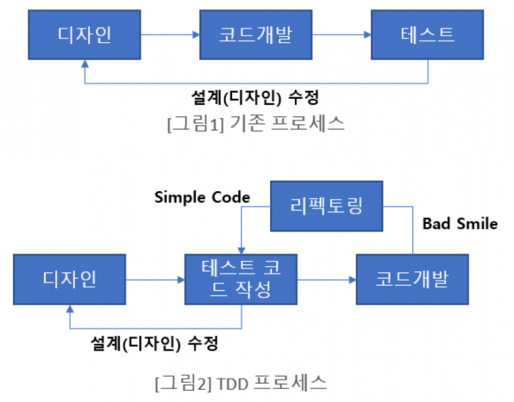

# TDD (Test Driven Development)

테스트 주도 개발(Test-driven development TDD)은 매우 짧은 개발 사이클을 반복하는 소프트웨어 개발 프로세스 중 하나이다.

이 기법을 개발했거나 '재발견' 한 것으로 인정되는 Kent Beck은 2003년에 TDD가 단순한 설계를 장려하고 자신감을 불어넣어준다고 말하였다.

## TDD 란?

작성해야하는 프로그램에 대한 테스트를 먼저 작성하고 이 테스트를 통과할 수 있도록 실제 프로그램의 코드를 작성한다. 

여기서 만드는 테스트도 그 자체로 하나의 프로그램이며 프로그램의 요구사항을 반영할 수 있게 만든다. 

## TDD 과정 요약

1. 테스트를 작성한다.
2. 작성한 테스트를 통과할 수 있도록 가장 빠른 방법으로 코드를 작성한다. 이 과정에 중복된 코드를 만들어도 상관 없다.
3. 테스트를 수행한다.
4. 테스트를 통과하면 작성한 코드에서 중복을 제거한다. 아니면 2번으로 돌아간다.
5. 테스트를 수행한다.
6. 테스트를 통과하면 완성. 다음 테스트를 1번부터 시작한다. 실패하면 4로 돌아가서 디버깅한다.

## Unit Test

### FIRST 규칙

1. Fast: 테스트는 빠르게 동작하여 자주 돌릴 수 있어야 한다.
2. Independent: 각각의 테스트는 독립적이며 서로 의존해서는 안된다.
3. Repeatable: 어느 환경에서도 반복 가능해야 한다.
4. Self-Validating: 테스트는 성공 또는 실패로 bool 값으로 결과를 내어 자체적으로 검증되어야 한다.
5. Timely: 테스트는 적시에 즉, 테스트하려는 실제 코드를 구현하기 직전에 구현해야 한다.  

### TestCode 만드는 과정 정리
코드가 완성된 상태로 테스트 코드를 다는 형태긴 하지만, 이후엔 tdd방식으로 진행할 것 이므로 나름대로 순서를 정해놓고 일을 진행하려 했다. 

나 혼자 만든 기준이기에 이게 좋다는것은 아니다. 테스트 코드를 처음 짤때 아래의 규칙을 혼자 정해놓고 작업 했다.

1. 코드작성
2. describe단에 어떤 주제에 대해 테스트 할지 적는다.
    - 예를 들어 A라는 component에 대해 테스트를 하면 descrbe("Component A Test", () => {}) 이런식으로 적는다.
3. test단에 구체적으로 어떻게 테스트 할지 적는다.
    - ex) A에 props로 temp1 을 줄때와 temp2를 줄때를 기능이 달라서 테스트 해야한다 하면 아래와 같이 적는다.
    - test("should do Something1 with props temp1" , () => {})
    - test("should do Something2 with props temp2" , () => {})
4. test케이스를 모두 정의 하고 나면 사이드 케이스가 없는지 한번 더 확인하고 그 후에 실제로 테스트 코드를 적는다.

2,3,4를 실제 코드를 가지고 있지 않은채로 기획을 보고 진행하면 그게 tdd인듯 하다.

실제 코드를 가지고 하는거보다 어려울 것으로 보이고, 기획 명세 변화, 기획만 보고는 알 수 없는 여러 사이드 케이스 등이 문제가 될 수 있다.

이런 문제를 발생시키지 않으려면 기획측에서도 어느정도 책임감 있는(?) 기획을 던져줘야 할것으로 보이고, 개발단에서도 신중하게 설계하고 테스트 코드를 짜야할 것 같다. 

### 참고 링크
https://gmlwjd9405.github.io/2018/05/26/what-is-agile.html

https://gmlwjd9405.github.io/2018/06/03/agile-tdd.html

https://web.archive.org/web/20070628064054/http://xper.org/wiki/xp/TestDrivenDevelopment

https://nhnent.dooray.com/share/posts/9jRYF1fxRwiCvwi6VM0VgA

https://mangkyu.tistory.com/143 
